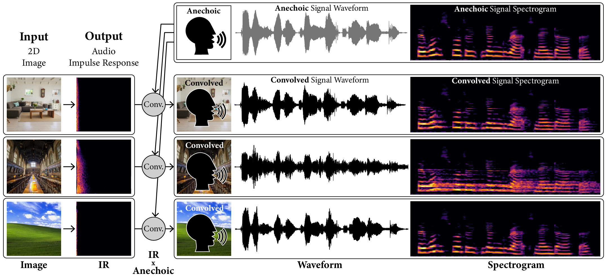

# Image2Reverb

[__Project Page__](https://web.media.mit.edu/~nsingh1/image2reverb/)

Code for the paper [Image2Reverb: Cross-Modal Reverb Impulse Response Synthesis](https://arxiv.org/abs/2103.14201). Image2Reverb is a method for generating audio impulse responses, to simulate the acoustic reverberation of a given environment, from a 2D image of it.




## Dependencies

**Model/Data:**

* PyTorch>=1.7.0
* PyTorch Lightning
* torchvision
* torchaudio
* librosa
* PyRoomAcoustics
* PIL

**Eval/Preprocessing:**

* PySoundfile
* SciPy
* Scikit-Learn
* python-acoustics
* google-images-download
* matplotlib


## Resources

[Model Checkpoint](https://media.mit.edu/~nsingh1/image2reverb/model.ckpt)


## Code Acknowlegdements

We borrow and adapt code snippets from [GANSynth](https://github.com/magenta/magenta/tree/master/magenta/models/gansynth) (and [this](https://github.com/ss12f32v/GANsynth-pytorch) PyTorch re-implementation), additional snippets from [this](https://github.com/shanexn/pytorch-pggan) PGGAN implementation, [monodepth2](https://github.com/nianticlabs/monodepth2), [this](https://github.com/jacobgil/pytorch-grad-cam) GradCAM implementation, and more.

## Citation

If you find the code, data, or models useful for your research, please consider citing our paper:

```bibtex
@article{singh2021image2reverb,
  title={Image2Reverb: Cross-Modal Reverb Impulse Response Synthesis},
  author={Singh, Nikhil and Mentch, Jeff and Ng, Jerry and Beveridge, Matthew and Drori, Iddo},
  journal={arXiv preprint arXiv:2103.14201},
  year={2021}
}
```
