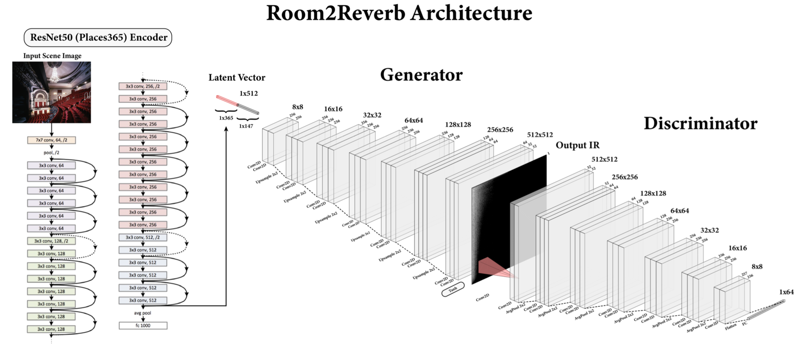
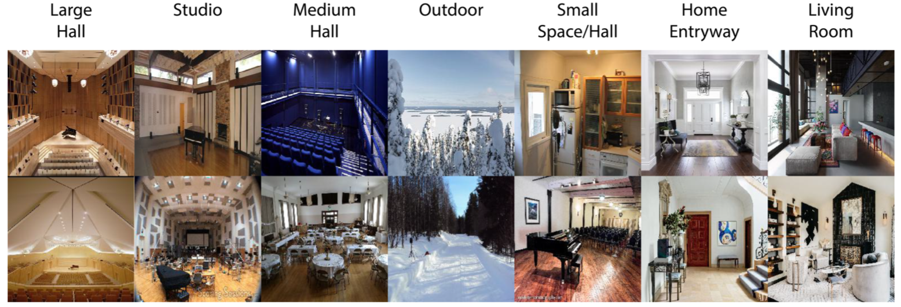

# room2reverb

room2reverb is a deep neural net model that directly synthesizes audio impulse responses (IRs) from visual images of acoustic environments.

The architecture is a conditional GAN built using PyTorch and using ResNet50 (pre-trained on Places365) as an encoder. room2reverb is a fully end-to-end acoustic impulse response generator currently being developed as a project in the Applied Machine Learning course 6.862 at MIT.

## Dependencies

**Model/Data:**

* PyTorch>=1.7.0
* torchvision
* torchaudio
* librosa
* PIL

**Eval/Preprocessing:**

* PySoundfile
* SciPy
* Scikit-Learn
* python-acoustics
* google-images-download
* matplotlib

Matlab (with the [IoSR Matlab Toolbox](https://github.com/IoSR-Surrey/MatlabToolbox)) is required to run the custom scripts used for calculating metrics and statistics of generated IRs, but not for the model itself.

## Usage

The pre-trained model will be uploaded and available for use.

Examples of scenes used to train our top-performing model:

## Why are we excited about room2reverb?

An effective and widely used method of simulating acoustic spaces relies on audio impulse responses (IRs) and convolution. Audio IRs are recorded measurements of how an environment responds to an acoustic stimulus. IRs can be measured by recording a space during a burst of white noise like a clap or balloon pop or a sinusoid swept across the range of human hearing. Accurately capturing these room impulse responses requires time, specialized equipment, knowledge, and planning. Directly recording these measurements may be entirely infeasible in continuously inhabited spaces of interest. End-to-end IR estimation has far ranging applications relevant to fields including music production, speech processing, and generating immersive extended reality (XR) environments. Considering the high costs yet far-reaching potential benefits of easily obtaining these measurements, here we implement a model that directly synthesizes perceptually plausible IRs from visual images of acoustic environments.

## Documentation

More details will be available once the class project is complete.

## Acknowledgments

We borrow and adapt code snippets from [GANSynth](https://github.com/magenta/magenta/tree/master/magenta/models/gansynth) (and [this](https://github.com/ss12f32v/GANsynth-pytorch) PyTorch re-implementation), data loading code from [Pix2PixHD](https://github.com/NVIDIA/pix2pixHD), and additional snippets from [this](https://github.com/shanexn/pytorch-pggan) PGGAN implementation.